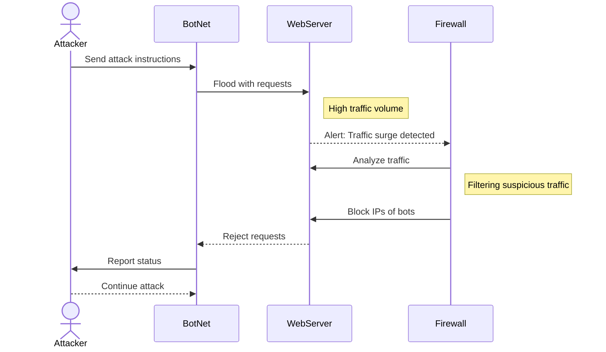

```mermaid
sequenceDiagram
    actor Attacker
    participant BotNet
    participant WebServer
    participant Firewall

    Attacker->>BotNet: Send attack instructions
    BotNet->>WebServer: Flood with requests
    Note right of WebServer: High traffic volume
    WebServer-->>Firewall: Alert: Traffic surge detected
    Firewall->>WebServer: Analyze traffic
    Note right of Firewall: Filtering suspicious traffic
    Firewall->>WebServer: Block IPs of bots
    WebServer-->>BotNet: Reject requests
    BotNet->>Attacker: Report status
    Attacker-->>BotNet: Continue attack
```