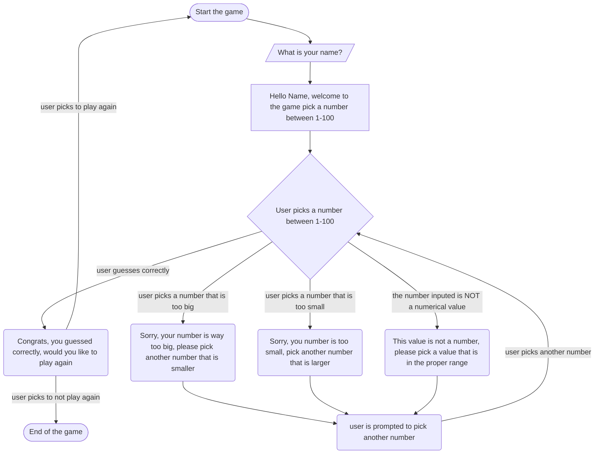

In this diagram, the user is first promted to give their name. Then they are prompted to give a number. If they win, they are able to play the game again or quit, where the loop end. Based on the users answer the game will tell them if thier answer is too big or too small or too big, and sugest to them to answer further to the answer. the user gets unlimted atempts and the range of answers is between 1-100